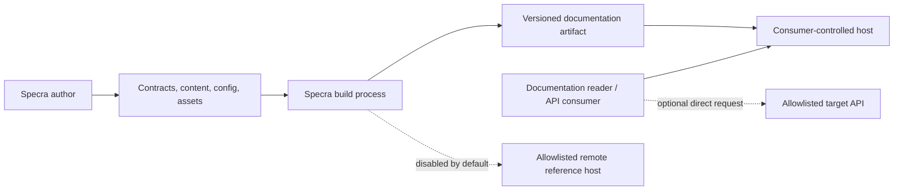
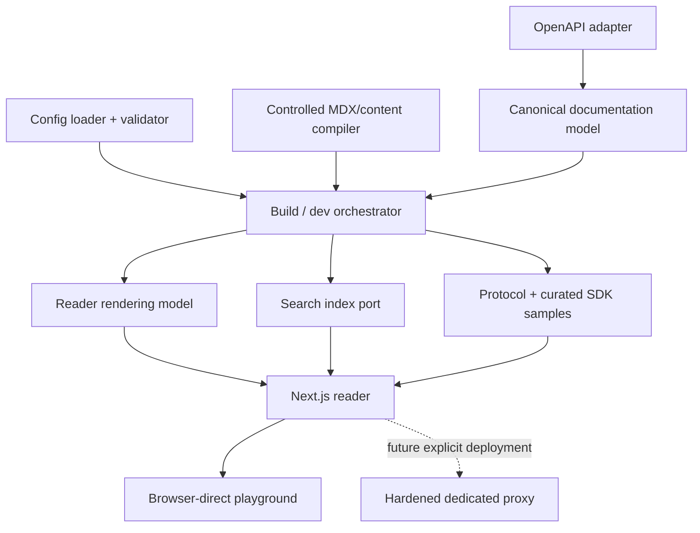
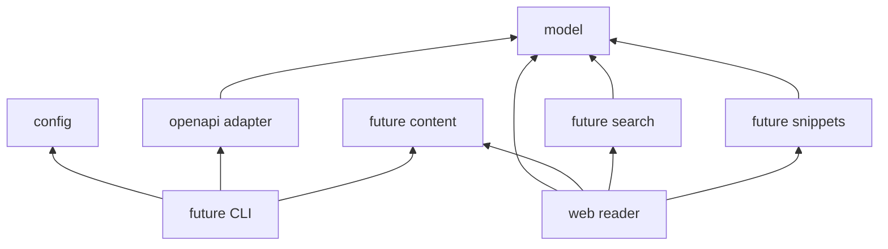
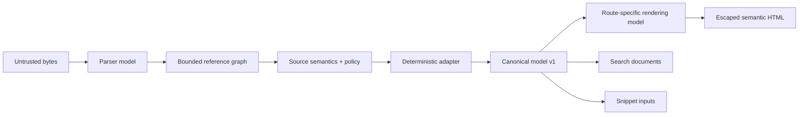

# Specra architecture

## Requirements summary

Specra combines machine-readable contracts, authored documentation, SDK mappings, navigation, and branding into versioned reader artifacts. It must support large and adversarial OpenAPI 3.x inputs, remain self-hostable, minimize runtime state, and allow source adapters, search providers, and deployment modes to evolve behind stable contracts.

## System context

The consuming product controls sources, deployment, approved API origins, and review. Specra controls transformation contracts and the default reader experience. Target APIs do not trust Specra merely because their documentation is hosted by it.

## Logical components

Components shown without packages are planned boundaries, not Phase 0 code.

## Repository and package boundaries

The repository is a pnpm monorepo without a separate build orchestrator. At this scale, pnpm's topological recursive commands provide enough ordering and cache-neutral simplicity.

| Boundary           | Current responsibility                                                 | May depend on                                                                |
| ------------------ | ---------------------------------------------------------------------- | ---------------------------------------------------------------------------- |
| `packages/model`   | Canonical serializable contracts and invariants                        | TypeScript/platform types only                                               |
| `packages/openapi` | Source parsing boundary, limits, reference policy; later normalization | `model`, focused parser/resolver libraries                                   |
| `packages/config`  | Serializable public configuration schema and defaults                  | focused validation libraries                                                 |
| `apps/web`         | Next.js reader shell and future rendering composition                  | canonical/rendering contracts, UI/content/search ports; never parser objects |

Future packages earn their existence when their slice begins: `content`, `search`, `snippets`, `ui`, and `cli` are expected candidates. `core` is not created because an orchestrator with a stable responsibility does not yet exist.

## Dependency direction

The model never depends on React, Next.js, parsers, config, or a source adapter. The reader never imports raw source representations. `scripts/check-architecture.mjs` enforces the critical subset now; a workspace graph tool can replace it when graph complexity justifies one.

## Data flow and model ownership

- **Source model:** original JSON/YAML bytes and origin metadata; immutable input, retained only for diagnostics when policy permits.
- **Parser model:** adapter-private representation retaining OpenAPI vocabulary and source pointers. It never crosses package boundaries into rendering.
- **Normalized model:** the canonical model in `@specra/model`; source-independent semantics, stable IDs, normalized methods/statuses, explicit unsupported nodes and diagnostics.
- **Rendering model:** small derived view state for a route or component. It may add presentation grouping, but never source semantics.

There is no second domain model between normalized and canonical. Search and snippets derive their own purpose-built documents from canonical input rather than mutating it.

## Canonical model

`DocumentationModel` is a versioned documentation projection, not a JSON Schema validator AST. It owns projects, documentation versions, authored-page metadata, services, operations, servers, authentication, parameters, media variants, responses, examples, and schemas. Schema recursion is represented through stable `SchemaId` references into a service registry, never object cycles. The Phase 0 draft includes boolean schemas, scalar constraints, arrays, tuples, objects, composition, discriminators, `additionalProperties`, metadata, and explicit unknown nodes. SPEC-001 must resolve keyword-without-type and mixed-vocabulary semantics before model v1 is frozen; adapters must emit capability diagnostics rather than narrow validation meaning silently.

Key invariants include operation IDs unique within a versioned service, required and template-matched path parameters, resolvable schema/security/server IDs, normalized uppercase HTTP methods, explicit response descriptions, deterministic ordering, JSON-only extension values, and no parser-library objects. Validation returns stable codes and JSON pointers.

The [normalization contract](normalization-contract.md) defines identity, ordering, serialization, and diagnostics. The [OpenAPI dialect map](openapi-dialects.md) identifies 3.0/3.1 conversions that must be proven before correctness claims.

OpenAPI-specific features such as callbacks are normalized into future canonical extension concepts only after use cases prove the abstraction; until then they produce capability diagnostics rather than lossy fake support.

## Build-time responsibilities

- Load a trusted local TypeScript config in an isolated build worker, then validate and convert it to serializable data.
- Read local sources within the configured project root; enforce byte, depth, key, example, and reference budgets.
- Resolve local references with cycle-aware graph traversal; remote retrieval requires explicit host and scheme policy.
- Validate OpenAPI and normalize deterministically to a versioned canonical artifact plus diagnostics.
- Compile reviewed content with a component allowlist and no arbitrary imports.
- Build route manifests, navigation, protocol samples, search documents, metadata, sitemap, redirects, and immutable version artifacts.
- Pre-highlight code and partition large model payloads by route/schema where practical.

Builds fail closed for errors and threshold breaches. Warnings are machine-readable and may be promoted by project policy.

## Runtime responsibilities

The default deployment serves pre-rendered or server-rendered reader routes, small route-specific payloads, a lazy search worker/index, and opt-in client islands for navigation, tabs, schema expansion, search, and playground forms. It holds no credential database and performs no generic upstream fetch. Static export is supported when selected features are static-compatible; Node deployment adds controlled runtime features.

## Frontend boundaries

Next.js App Router uses React Server Components by default. Client components are leaf islands with explicit state ownership. URL-addressable selection (version, operation, headings where useful) stays in routes; ephemeral UI state stays local. Schema trees render depth-bounded summaries and expand lazily. Desktop may use navigation/content/tools regions; mobile uses a focused reading flow with drawers and explicit mode changes, not a stacked three-column page.

Theming uses validated design tokens with contrast-aware defaults. Arbitrary CSS is not the default extension mechanism. Source strings render as text or through a sanitizer with a tested allowlist; `dangerouslySetInnerHTML` is prohibited for raw content.

## Search, versioning, and changelog

The initial search port consumes version-scoped `SearchDocument` records produced at build time and returns typed result IDs. A local compressed index loads on demand; implementation remains replaceable. Search indexes visible normalized text, never secrets or hidden examples.

Documentation releases are explicit config entries, not application deployments. Immutable retained versions use `/docs/{version}` and are self-canonical. `/docs` is a convenience alias that issues a non-permanent `302` or `307` redirect to the configured current immutable version; it is not emitted in the sitemap. Redirects are validated, sitemaps include retained public versions, and search is version-scoped by default.

Contract diffing will produce structured candidate changes linked to source pointers. Authors review and edit changelog entries before publication.

## Configuration

Public configuration starts at `schemaVersion: 1`, receives strict validation, has documented defaults, and becomes a serializable resolved form. TypeScript config offers type checking but is executable trusted developer code. Hosted or untrusted workflows accept data-only JSON/YAML, not `.ts`. Deprecations warn for at least one documented migration window before removal.

## Playground and credentials

The first implementation is browser-direct and disabled unless a project enables approved environments. This exposes normal CORS requirements but keeps user credentials out of Specra infrastructure. Credentials live in component memory by default; optional tab-scoped session storage may be a clearly labeled future opt-in. They never enter URLs, local storage, cookies, server persistence, logs, analytics, traces, crash reports, or screenshots.

APIs that cannot support browser CORS may later deploy a separate hardened proxy, never an implicit web-app endpoint. Its mandatory controls are documented in the threat model and ADR-005.

## Deployment and failure modes

The build output is reproducible from locked source and dependencies. Consumers may run a Node server behind TLS/CDN or static output where compatible. No database, queue, or external search service is required initially.

Security headers are a deployment invariant, not merely framework configuration. The Node deployment emits them from Next.js; static hosts and CDNs must reproduce the same effective policy from generated deployment metadata and are verified against a deployed artifact. See [deployment requirements](../deployment.md).

| Failure                           | Behavior                                                       | Mitigation                                                         |
| --------------------------------- | -------------------------------------------------------------- | ------------------------------------------------------------------ |
| Invalid or oversized source       | Build fails with redacted stable diagnostics                   | Limits, source pointers, author correction                         |
| Recursive/cyclic schema           | Registry references preserve cycles without recursion overflow | Iterative traversal and expansion budgets                          |
| Search-index build fails          | Build fails; no silently stale index                           | Deterministic index contract and tests                             |
| Optional search chunk unavailable | Reading/navigation continue; search reports unavailable        | Lazy isolated asset and error boundary                             |
| Target API unavailable            | Playground reports bounded network failure                     | Timeout, cancellation, no automatic retry of mutations             |
| Config execution compromised      | Build-worker authority may be compromised                      | Trusted-only rule, isolated CI, data-only mode for untrusted input |
| CDN/server outage                 | Portal unavailable                                             | Consumer deployment redundancy and immutable artifact rollback     |

## Architecture evolution

Significant boundary changes require an ADR. The roadmap introduces one vertical slice at a time and requires objective, non-goals, acceptance criteria, tests, security analysis, docs, and Definition of Done.
