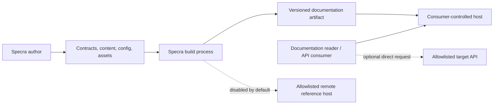
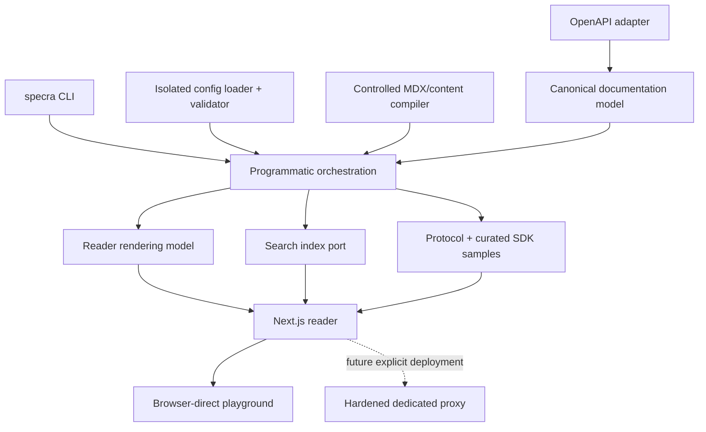
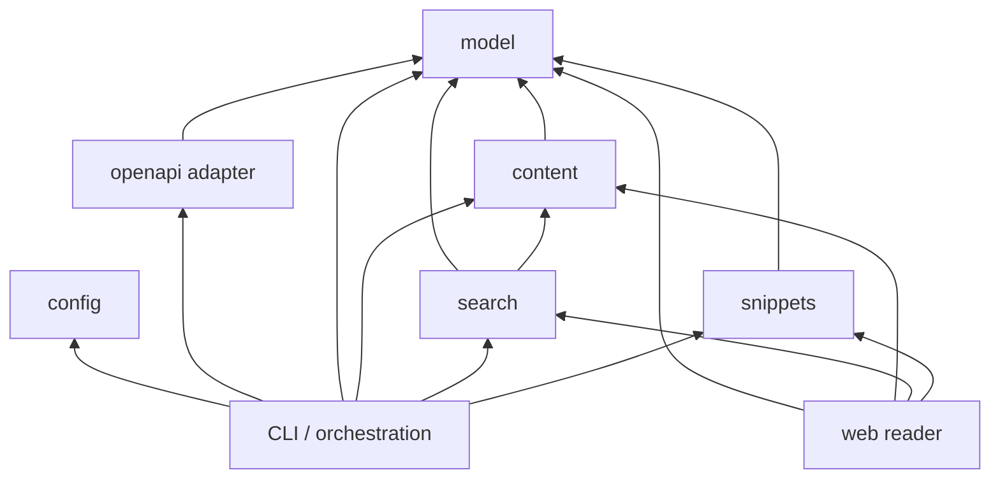
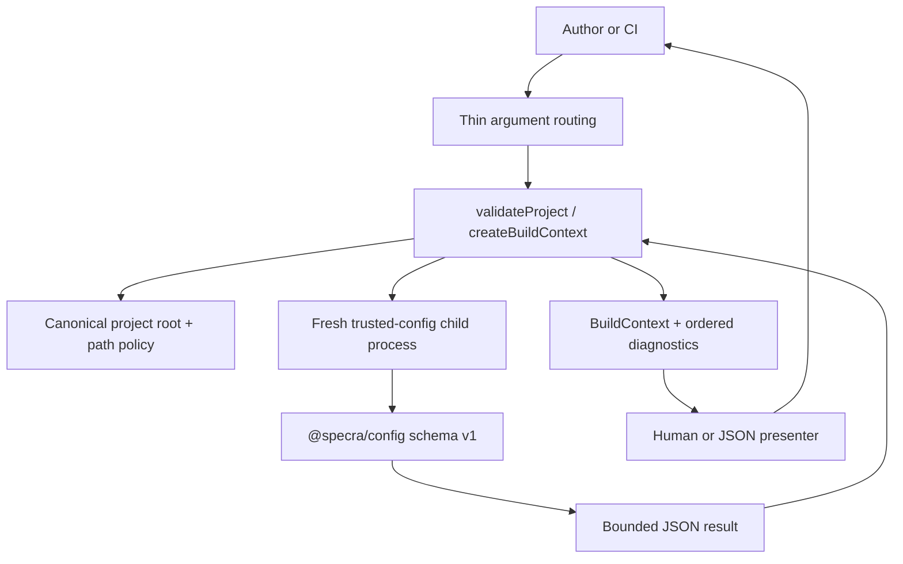
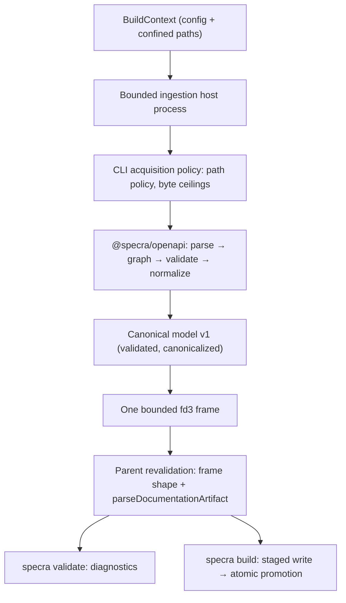
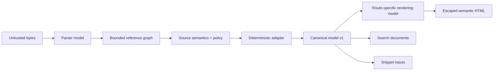
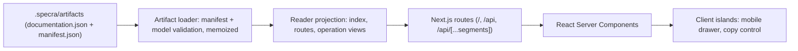
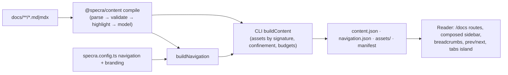
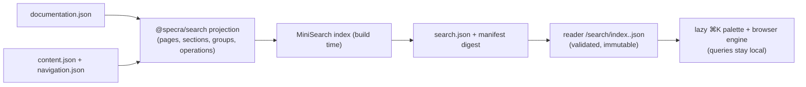
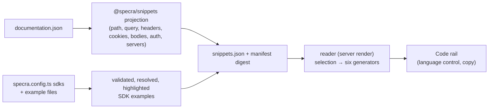

# Specra architecture

## Requirements summary

Specra combines machine-readable contracts, authored documentation, SDK mappings, navigation, and branding into versioned reader artifacts. It must support large and adversarial OpenAPI 3.x inputs, remain self-hostable, minimize runtime state, and allow source adapters, search providers, and deployment modes to evolve behind stable contracts.

## System context



The consuming product controls sources, deployment, approved API origins, and review. Specra controls transformation contracts and the default reader experience. Target APIs do not trust Specra merely because their documentation is hosted by it.

## Logical components



The CLI, config loader, and initial orchestration context are implemented by SPEC-002. Other components shown without packages remain planned boundaries.

## Repository and package boundaries

The repository is a pnpm monorepo with a thin author-workflow orchestrator. Pnpm's topological recursive commands remain sufficient for building the workspace itself.

| Boundary           | Current responsibility                                                  | May depend on                                                                 |
| ------------------ | ----------------------------------------------------------------------- | ----------------------------------------------------------------------------- |
| `packages/model`   | Canonical serializable contracts and invariants                         | TypeScript/platform types only                                                |
| `packages/openapi` | Bounded parse, confined reference graph, OpenAPI 3.0/3.1 normalization  | `model`, `yaml`; no filesystem or network access                              |
| `packages/config`  | Serializable public configuration schema and defaults                   | focused validation libraries                                                  |
| `packages/cli`     | CLI parsing/presentation, bounded hosts, acquisition policy, artifacts  | `config`, `model`, `openapi`; the only package allowed filesystem/network I/O |
| `apps/web`         | Next.js reader: artifact loader, reader projection, server-first routes | `@specra/model` contracts and `@specra/config` only; never parser objects     |

`content`, `search`, and `snippets` now exist; `ui` remains an expected candidate. The concrete orchestration responsibility now lives with `cli`; a generic `core` package is still unjustified.

## Dependency direction



The model never depends on React, Next.js, parsers, config, or a source adapter. The reader never imports raw source representations. `scripts/check-architecture.mjs` discovers every workspace package and enforces one direction table: each package needs an entry and each entry needs a package; source imports and every internal manifest dependency section must follow the table; internal imports must be declared in the importing manifest; relative imports must stay inside their package; and library/executable packages must not use browser globals, opaque runtime loading, process-boundary modules (`child_process`, `worker_threads`, `vm`, `cluster`), or, outside the CLI, filesystem/network modules and the global `fetch` in production code, so no package other than the CLI can open a file or socket and no hidden source loader can exist. Browser-global detection binds identifiers with the TypeScript checker, so locally declared names such as an OpenAPI `document` variable are not false positives. The trusted-config host is the single reviewed opaque-load exception with an exact recorded count, and the bounded-host runner shared by the config and ingestion loaders is the single process-boundary exception. The checker self-tests each rule on every run; a workspace graph tool can replace it when graph complexity justifies one.

## SPEC-002 orchestration flow



The CLI owns only argument parsing, routing, presentation, signals, and exit projection. Programmatic orchestration owns root selection, isolated-process lifecycle, path confinement, deterministic diagnostics, and the initial artifact context. It writes no terminal output and does not exit the calling process. `BuildContext` contains validated config, canonical roots/resolved source paths, `.specra/artifacts`, and an `AbortSignal`; it contains no OpenAPI parser, content compiler, renderer, or web object.

Config evaluation uses a fresh child process and process group with bounded time, captured raw and stream output, memory/stack hints, forced tree termination, and a bounded validated fd3 protocol. This contains synchronous native blocking work, ordinary descendants, raw descriptor writes, and accidental process exits while retaining trusted code's filesystem, environment, network, and process-user authority. Only schema-v1 JSON data is accepted by the parent, and it is validated on both sides of the boundary.

## SPEC-003 ingestion flow



The adapter owns no I/O. Every byte it parses arrives through the `SourceAcquisition` port that the CLI implements on top of the SPEC-002 path policy, which re-confines each project-relative document id physically and enforces byte ceilings before and after reading. Remote references are diagnosed and never fetched. The host process inherits the SPEC-002 lifecycle guarantees (timeout, cancellation, output caps, tree termination), and the parent trusts nothing it cannot revalidate. See [ADR-009](../adr/009-openapi-ingestion-and-source-isolation.md) and the [OpenAPI ingestion reference](../openapi.md).

## Data flow and model ownership



- **Source model:** original JSON/YAML bytes and origin metadata; immutable input, retained only for diagnostics when policy permits.
- **Parser model:** adapter-private representation retaining OpenAPI vocabulary and source pointers. It never crosses package boundaries into rendering.
- **Normalized model:** the canonical model in `@specra/model`; source-independent semantics, stable IDs, normalized methods/statuses, explicit unsupported nodes and diagnostics.
- **Rendering model:** small derived view state for a route or component. It may add presentation grouping, but never source semantics. SPEC-004 implements it as the reader projection in `apps/web/lib/reader` (route identity, navigation grouping, operation views, page metadata), documented in ADR-010; SPEC-005 adds the schema view projection (`schema-view.ts`), a bounded, context-aware tree over the canonical schema registry that the server renderer turns into native-disclosure HTML.

  ```text
  Canonical schema registry (ApiService.schemas, SchemaId → SchemaNode)
            ↓ createSchemaView(node, { context, registry, budget })
  Schema view projection (SchemaView tree with structural locators)
            ↓ <SchemaBlock> / <SchemaDisclosure> (React Server Components)
  Server HTML with native <details>/<summary> disclosures
            ↓ (no client state; the focused view is a validated query on the operation route)
  ```

  Renderer state ownership: the server owns everything. Expansion identity is the structural locator, disclosure state is the browser's native `open` attribute, recursion is decided by the ancestry of registry IDs during projection, and the only "navigation state" is the `?schema=&at=` query of the focused view. Budgets (depth 6, 400 nodes, 200 properties, 20 variants, 200 enum values) live in `DEFAULT_SCHEMA_BUDGET` and are enforced in the projection, never in the renderer. See the [reader reference](../reader.md#schema-rendering) and ADR-011 for the additive schema-name contract.

There is no second domain model between normalized and canonical. Search and snippets derive their own purpose-built documents from canonical input rather than mutating it.

## Canonical model

`DocumentationModel` is a versioned documentation projection, not a JSON Schema
validator AST. It owns projects, documentation versions, authored-page metadata,
services, operations, servers, authentication, parameters, media variants, responses,
examples, and schemas. Model v1 is frozen by SPEC-001: recursion uses stable registry
references, type-less constraints never imply a type, boolean forms remain explicit,
composition is not flattened, and mixed/unsupported vocabulary receives linked
capability diagnostics rather than silent narrowing. See the
[canonical model reference](canonical-model.md),
[normalization contract](normalization-contract.md), and
[diagnostic catalog](model-diagnostics.md).

Key invariants include operation IDs unique within a versioned service, required and template-matched path parameters, resolvable schema/security/server IDs, normalized uppercase HTTP methods, explicit response descriptions, deterministic ordering, JSON-only extension values, and no parser-library objects. Validation returns stable codes and JSON pointers.

The [normalization contract](normalization-contract.md) defines identity, ordering, serialization, and diagnostics. The [OpenAPI dialect map](openapi-dialects.md) identifies 3.0/3.1 conversions that must be proven before correctness claims.

OpenAPI-specific features such as callbacks are normalized into future canonical extension concepts only after use cases prove the abstraction; until then they produce capability diagnostics rather than lossy fake support.

## Build-time responsibilities

- Load trusted local erasable-TypeScript config in an isolated process lifecycle, then validate and convert it to bounded serializable data. This SPEC-002 responsibility is implemented.
- Read local sources within the configured project root; enforce byte, depth, node, string, document, reference, operation, example, and diagnostic budgets. Implemented in SPEC-003.
- Resolve local references with cycle-aware graph traversal; remote retrieval stays disabled (an opt-in hardened mode would require explicit host and scheme policy plus the ADR-002 controls). Implemented in SPEC-003.
- Validate OpenAPI 3.0/3.1 and normalize deterministically to a versioned canonical artifact plus diagnostics; `specra build` writes `documentation.json` and `manifest.json` atomically. Implemented in SPEC-003.
- Compile reviewed content with a component allowlist and no arbitrary imports. Implemented in SPEC-006 (`@specra/content`, ADR-012): Markdown/MDX parsed to an AST, validated against the Callout/Steps/Cards/Tabs/CodeGroup vocabulary, highlighted at build time, and serialized to `content.json`, `navigation.json`, and content-addressed `assets/`.
- Build route manifests, navigation, protocol samples, search documents, metadata, sitemap, redirects, and immutable version artifacts.
- Pre-highlight code and partition large model payloads by route/schema where practical.

Builds fail closed for errors and threshold breaches. Warnings are machine-readable and may be promoted by project policy.

SPEC-002 establishes `.specra/artifacts` as the deterministic project-relative artifact root. `validate` resolves but never creates or cleans it; SPEC-003's `build` writes it through a staged directory and atomic rename, removes it after a failed build, and refuses a symlinked entry. Existing source paths use canonical real paths; a not-yet-created artifact tail is proven against its nearest existing real ancestor. Every future filesystem access must revalidate immediately before use because point-in-time checks cannot eliminate symlink replacement races.

## Reader (SPEC-004)



Build time: `specra build` produces the artifact; `next build` compiles the reader and fails when `SPECRA_PROJECT_ROOT` holds no valid artifact. Runtime: every documentation route renders on demand from the one validated artifact under a per-request nonce CSP; the theme choice is a cookie set by a form-post handler. Trust: the artifact is validated through `parseDocumentationArtifact` and `parseArtifactManifest` before any render, and every canonical string is rendered as text. Client boundary: navigation, endpoint content, and metadata are server HTML; only the drawer control and the copy button hydrate. See the [reader reference](../reader.md), the [design contract](../design/reader-v1.md), and ADR-010.

## Authored content (SPEC-006)



`@specra/content` is a build-time package that depends on `@specra/model` only; the CLI and the reader may depend on it (the reader uses its artifact parsers and types). Authored text never becomes code: expressions, ESM, raw HTML, unknown components, and non-string props are diagnostics with a source line and column. The reader composes one sidebar from the navigation artifact and the API projection, keeps the nonce CSP unchanged, and serves assets only by manifest name.

## Search (SPEC-007)



`@specra/search` depends on `@specra/model` and `@specra/content` only; its `./client` entry is browser-safe and carries the engine alone. The CLI generates the index from the exact artifacts it is about to write, so search is part of the atomic build. The reader validates the artifact against the manifest digest before serving it and loads the engine on first open. ADR-013 records the engine evaluation and the privacy policy.

## Code samples and SDK mappings (SPEC-008)



`@specra/snippets` depends on `@specra/model` only and is pure: projection and the six generators (cURL, HTTP, JavaScript, TypeScript, Java, Python) read nothing but their input. The artifact stores projections, so it is linear in operations and independent of environments; the reader generates the texts on render, memoized per artifact digest, and ships no generator to the browser (the architecture gate forbids build-only imports from client islands and the bundle gate scans client chunks). SDK examples are consumer data declared in the config and resolved to canonical identity at build time; Specra never infers an SDK call. ADR-014 records the decisions; the [code samples reference](../code-samples.md) documents the contracts.

## Runtime responsibilities

The default deployment serves pre-rendered or server-rendered reader routes, small route-specific payloads, a lazy search worker/index, and opt-in client islands for navigation, tabs, schema expansion, search, and playground forms. It holds no credential database and performs no generic upstream fetch. Static export is supported when selected features are static-compatible; Node deployment adds controlled runtime features.

## Frontend boundaries

Next.js App Router uses React Server Components by default. Client components are leaf islands with explicit state ownership. URL-addressable selection (version, operation, headings where useful) stays in routes; ephemeral UI state stays local. Schema trees render depth-bounded summaries and expand lazily. Desktop may use navigation/content/tools regions; mobile uses a focused reading flow with drawers and explicit mode changes, not a stacked three-column page.

Theming uses validated design tokens with contrast-aware defaults. Arbitrary CSS is not the default extension mechanism. Source strings render as text or through a sanitizer with a tested allowlist; `dangerouslySetInnerHTML` is prohibited for raw content.

## Search, versioning, and changelog

The initial search port consumes version-scoped `SearchDocument` records produced at build time and returns typed result IDs. A local compressed index loads on demand; implementation remains replaceable. Search indexes visible normalized text, never secrets or hidden examples.

Documentation releases are explicit config entries, not application deployments. Immutable retained versions use `/docs/{version}` and are self-canonical. `/docs` is a convenience alias that issues a non-permanent `302` or `307` redirect to the configured current immutable version; it is not emitted in the sitemap. Redirects are validated, sitemaps include retained public versions, and search is version-scoped by default.

Contract diffing will produce structured candidate changes linked to source pointers. Authors review and edit changelog entries before publication.

## Configuration

Public configuration starts at `schemaVersion: 1`, receives strict validation, has documented defaults, and becomes a serializable resolved form. TypeScript config offers type checking but is executable trusted developer code. Hosted or untrusted workflows accept data-only JSON/YAML, not `.ts`. Deprecations warn for at least one documented migration window before removal.

## Playground and credentials

The implementation (SPEC-009, [ADR-015](../adr/015-browser-direct-playground.md)) is browser-direct and disabled unless a project enables approved environments (`playground.mode: "browser"` plus `playground.environments`). `specra build` derives `playground.json`, a policy of exact origins, clamped limits, and one bounded form per operation with a browser-capability verdict; the reader verifies it against the manifest digest, emits `connect-src` for exactly those origins on API routes, and the Try it island composes each request through the same serializer as the code examples and asserts the destination before one hardened `fetch`. This exposes normal CORS requirements but keeps user credentials out of Specra infrastructure; see the [playground reference](../playground.md). Credentials live in component memory by default; optional tab-scoped session storage may be a clearly labeled future opt-in. They never enter URLs, local storage, cookies, server persistence, logs, analytics, traces, crash reports, or screenshots.

APIs that cannot support browser CORS may later deploy a separate hardened proxy, never an implicit web-app endpoint. Its mandatory controls are documented in the threat model and ADR-005.

## Deployment and failure modes

The build output is reproducible from locked source and dependencies. Consumers may run a Node server behind TLS/CDN or static output where compatible. No database, queue, or external search service is required initially.

Security headers are a deployment invariant, not merely framework configuration. The Node deployment emits them from Next.js; static hosts and CDNs must reproduce the same effective policy from generated deployment metadata and are verified against a deployed artifact. See [deployment requirements](../deployment.md).

| Failure                           | Behavior                                                              | Mitigation                                                                      |
| --------------------------------- | --------------------------------------------------------------------- | ------------------------------------------------------------------------------- |
| Invalid or oversized source       | Build fails with redacted stable diagnostics; stale artifacts removed | Limits, source pointers, author correction                                      |
| Ingestion host hangs or crashes   | `INGESTION_TIMEOUT` / `INGESTION_FAILED`; nothing partial written     | Bounded host, tree termination, parent revalidation                             |
| Recursive/cyclic schema           | Registry references preserve cycles without recursion overflow        | Iterative traversal and expansion budgets                                       |
| Search-index build fails          | Build fails; no silently stale index                                  | Deterministic index contract and tests                                          |
| Optional search chunk unavailable | Reading/navigation continue; search reports unavailable               | Lazy isolated asset and error boundary                                          |
| Target API unavailable            | Playground reports bounded network failure                            | Timeout, cancellation, no automatic retry of mutations                          |
| Config execution hangs/leaks      | Build availability or environment values are exposed                  | Timeout/cancel, output/result limits, value-free errors, terminate process tree |
| Trusted config is malicious       | Build-user filesystem/network authority may be compromised            | Trusted-only rule, least-privilege CI, data-only untrusted mode                 |
| Path changes after validation     | Later read/write follows a replaced symlink                           | Revalidate at use, fail closed, keep artifact operations root-fixed             |
| CDN/server outage                 | Portal unavailable                                                    | Consumer deployment redundancy and immutable artifact rollback                  |

## Architecture evolution

Significant boundary changes require an ADR. The roadmap introduces one vertical slice at a time and requires objective, non-goals, acceptance criteria, tests, security analysis, docs, and Definition of Done.
