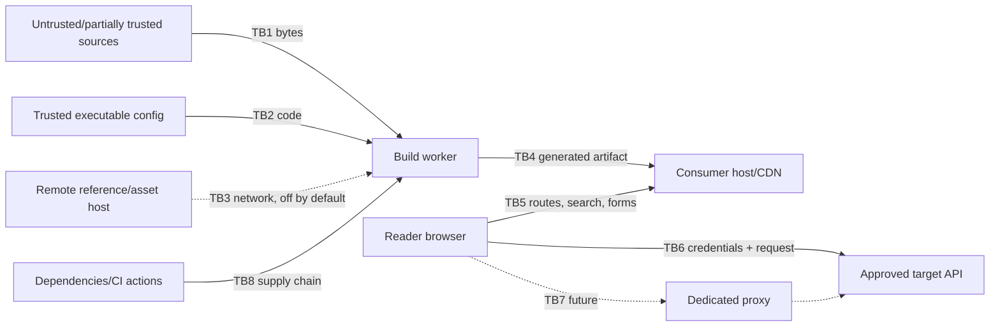

# Specra threat model

## Scope and method

This Phase 0 threat model covers source ingestion, build and content compilation, generated artifacts, browser runtime, search, future playground networking, configuration, assets, CI, and dependencies. It applies STRIDE at each trust boundary. Deployment-specific authentication for private portals remains the consumer's responsibility.

## Assets

- Playground credentials and authorization material
- Private API contracts, authored content, examples, and SDK mappings
- Integrity of generated documentation, navigation, code samples, and changelog
- Consumer build/CI credentials and filesystem
- Reader browser origin and session
- Upstream API availability and data
- Build availability, memory, CPU, caches, logs, telemetry, and artifacts
- Specra release and dependency supply chain

## Actors

- Trusted Specra contributors and consumer maintainers
- Trusted or partially trusted documentation authors
- Anonymous or authenticated readers
- Malicious source/asset supplier or compromised dependency
- External attacker controlling a referenced host, DNS, target API, or browser input
- Insider with repository or build access

## Trust boundaries and entry points

Entry points include JSON/YAML contracts, `$ref`, Markdown/MDX, config, SDK examples, images/fonts, URLs/redirects, navigation/search terms, query/fragment state, playground fields, target responses, environment variables, dependencies, and CI artifacts.

## Threats and controls

| Surface / STRIDE            | Abuse scenario                                                                         | Required controls                                                                                                                                                                                 | Residual risk                                                                              |
| --------------------------- | -------------------------------------------------------------------------------------- | ------------------------------------------------------------------------------------------------------------------------------------------------------------------------------------------------- | ------------------------------------------------------------------------------------------ |
| OpenAPI/content: T/I/E      | HTML, Markdown, examples, or extension values execute script                           | React text escaping; controlled Markdown AST; sanitizer allowlist only where HTML is explicitly supported; no raw HTML/`dangerouslySetInnerHTML`; CSP                                             | Sanitizer/framework bugs; consumer-authored links can still lead off-site                  |
| OpenAPI: D                  | Huge/deep strings, aliases, refs, recursion, regex, examples exhaust build/browser     | Byte/key/depth/string/example/ref budgets; YAML aliases disabled; iterative graph; cycle IDs; time/memory CI budgets; lazy schema UI                                                              | Deliberately complex valid contracts may need reviewed limit increases                     |
| References: I/D             | Remote ref probes internal networks, redirects, DNS rebinding, leaks build credentials | Remote refs off by default; local-root confinement; opt-in HTTPS host allowlist; redirect deny; resolve/pin public IP; proxy egress policy; timeout/size/content limits; no ambient auth          | Approved host compromise; resolver TOCTOU without pinned transport                         |
| MDX/config: E               | Imported MDX or TS config runs arbitrary build code                                    | Content is controlled static compilation with component/import allowlist and no arbitrary expressions; TypeScript config explicitly trusted and isolated; untrusted services use data-only config | Trusted repository compromise retains build authority                                      |
| Search: I/T                 | Secret examples indexed; markup poisons results                                        | Index only normalized visible fields; text encoding; size limits; version/project partition; no credentials; deterministic IDs                                                                    | Authors may publish sensitive prose unless source review catches it                        |
| Branding/assets: I/T        | SVG/script, tracking pixels, remote fonts leak reader data                             | Local assets by default; image type/size validation; sanitize or rasterize SVG; remote origins explicit in CSP/config; integrity/caching policy                                                   | Complex image decoder and CDN risks                                                        |
| Browser: S/T/I              | Framing, injection, referrer leakage, unsafe deep links                                | CSP, `frame-ancestors`, no objects, Referrer/Permissions policies, URL validation, semantic text rendering, HTTPS/HSTS at deployment, secure cookies if consumer adds auth                        | Initial Next CSP needs inline script/style allowances; tighten with nonces in reader slice |
| Playground credentials: I/R | Token appears in storage, URL, logs, analytics, errors, screenshots                    | Memory only default; password inputs; redaction at every diagnostic boundary; no telemetry payloads; clear-on-unmount/navigation; test fixtures use unmistakably fake values                      | Browser extensions, compromised origin, and user screen capture remain capable of access   |
| Playground requests: T/D/E  | Arbitrary destinations, redirects, oversized bodies/responses, streaming, smuggling    | Browser-direct approved base URLs first; future proxy is separately deployed and hardened as below; mutation retries off; cancellation/timeouts                                                   | Target API and browser CORS behavior vary                                                  |
| Supply chain: T/E           | Malicious or vulnerable package/action executes at install/build                       | Exact manifests + lockfile, frozen CI, minimal dependencies, audit, dependency review, license gate, update review, action pinning policy, isolated least-privilege jobs                          | Registry/maintainer compromise before detection                                            |
| Logs/observability: I       | Headers or payloads enter logs/traces/crash reports                                    | Structured event allowlist, deny secret field names, value redaction, body omission, build source excerpts opt-in and bounded, retention controlled by consumer                                   | Novel custom header names may evade name-based redaction                                   |
| Generated artifact: T/R     | Stale or modified docs mislead consumers                                               | Immutable versioned output, provenance manifest/checksum later, reviewed changelog, deterministic build, protected deployment                                                                     | Compromised hosting credentials can replace artifacts                                      |

## Playground networking decision

Four models were evaluated:

| Model                        | Security                                                                 | DX/CORS                                                   | Infrastructure/observability                                          |
| ---------------------------- | ------------------------------------------------------------------------ | --------------------------------------------------------- | --------------------------------------------------------------------- |
| Browser → API                | No Specra SSRF or server credential custody; target visible to browser   | Requires API CORS; browser restricts some headers/cookies | Lowest operations; target owns rate limits and request logs           |
| Web backend → configured API | Central CORS workaround but couples renderer to a high-risk SSRF surface | Smooth DX                                                 | Every deployment must harden egress, credentials, scaling, audit      |
| Dedicated hardened proxy     | Strong isolation and explicit deployment; still SSRF-sensitive           | Smooth for approved targets                               | Separate operations, rate limits, audit, egress and incident boundary |
| Hybrid                       | Lets each environment choose                                             | Most flexible, more modes to explain/test                 | Highest policy complexity                                             |

Decision: implement browser-direct first, off by default. Design a proxy port but do not ship a proxy in initial slices. A consumer that later needs one deploys a dedicated hardened component and selects it explicitly; Specra's general web backend never silently becomes a proxy.

Mandatory proxy controls are exact configured upstream origins and path policy; HTTP(S) schemes only with HTTPS default; arbitrary URL fields forbidden; credentials mapped to a named server-side secret rather than accepted as destination authority; resolution of every A/AAAA record; denial of loopback, link-local, private, unique-local, multicast, reserved, unspecified, and cloud metadata addresses; DNS pinning to the validated connection or an egress filter; redirects disabled; Host/TLS SNI bound to the approved host; connection/request/response/idle timeouts; request and response byte limits; streaming limits; method/content-type/header allowlists; hop-by-hop and forwarding header removal; no cookie jar; decompression limits; concurrency and per-project/user/IP rate limits; cancellation; audit events without secret/payload values; and network isolation from internal services.

Responses are never cached by default because authorization and sensitive bodies make cache keys unsafe. Logs capture request ID, configured environment ID, method, normalized route template where possible, status class, bounded latency, and redacted error code—not query values, headers, bodies, or full URLs.

## Credential policy

Credential entry is local component state and defaults to memory-only. Values are never placed in local storage, cookies, URLs, route state, server sessions, build output, analytics, tracing, error reports, logs, clipboard automatically, or test screenshots. A future tab-scoped session-storage option requires explicit project and user opt-in, a visible persistence indicator, TTL, clear control, origin isolation analysis, and an ADR update. OAuth uses PKCE and provider-approved redirect origins; tokens follow the same policy. Specra does not accept credentials into a general proxy request body for persistence.

## Content trust policy

Repository authors and reviewers are trusted to contribute content, but content text is not trusted as executable code. The compiler accepts Markdown plus a fixed Specra component vocabulary, validates props as data, rejects arbitrary imports/exports/expressions and raw HTML by default, limits include roots and sizes, and renders escaped output. Consumer-supplied React components or unrestricted MDX are an advanced trusted-code mode outside the initial product.

## Security verification

Current gates test byte/depth/node/string limits and invalid budgets, non-finite values, YAML aliases, exact-origin remote-ref policy, script-looking source as inert data, diagnostic redaction canaries, strict path and environment config, architecture boundaries including relative-import self-tests, delivered HTTP security headers, keyboard/reflow/axe browser behavior, audit, license policy, secret patterns, and dependency review. Future slices add symlink-confinement tests, resolver rebinding harnesses, sanitizer properties, nonce/hash CSP tests, OAuth tests, proxy egress tests, body/stream limits, and abuse-rate tests.

## Residual risks and owners

- **P1 disposition:** CSP currently needs Next's inline script/style allowances. The minimal page has no untrusted HTML; SPEC-004 owns nonce/hash evaluation before interactive rendering is declared production-ready.
- **P1 disposition:** A production OpenAPI resolver is intentionally unselected. SPEC-003 cannot enable remote refs until pinned-resolution and root-confinement tests pass.
- **Resolved in SPEC-000:** CI actions run on Node 24-compatible releases and are pinned to reviewed full commit SHAs.
- **P2 tracked:** Asset sanitization is design-only because branding ingestion is not implemented; SPEC-006 owns enforcement.
- **Accepted environmental risk:** malicious code already committed to a trusted consumer repository can execute in its build via config or dependencies. Builds require isolated, least-privilege CI with no production secrets.
