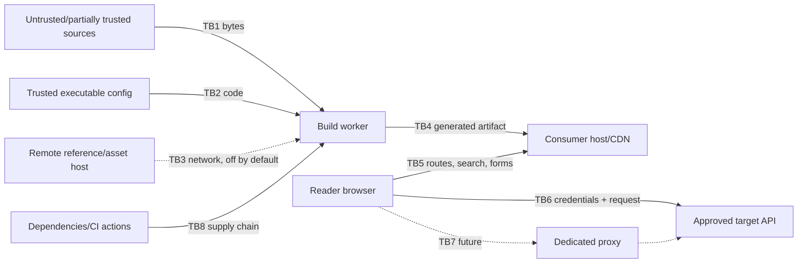

# Specra threat model

## Scope and method

This Phase 0 threat model covers source ingestion, build and content compilation, generated artifacts, browser runtime, search, future playground networking, configuration, assets, CI, and dependencies. It applies STRIDE at each trust boundary. Deployment-specific authentication for private portals remains the consumer's responsibility.

## Assets

- Playground credentials and authorization material
- Private API contracts, authored content, examples, and SDK mappings
- Integrity of generated documentation, navigation, code samples, and changelog
- Consumer build/CI credentials and filesystem
- Reader browser origin and session
- Upstream API availability and data
- Build availability, memory, CPU, caches, logs, telemetry, and artifacts
- Specra release and dependency supply chain

## Actors

- Trusted Specra contributors and consumer maintainers
- Trusted or partially trusted documentation authors
- Anonymous or authenticated readers
- Malicious source/asset supplier or compromised dependency
- External attacker controlling a referenced host, DNS, target API, or browser input
- Insider with repository or build access

## Trust boundaries and entry points

Entry points include JSON/YAML contracts, `$ref`, Markdown/MDX, config, SDK examples, images/fonts, URLs/redirects, navigation/search terms, query/fragment state, playground fields, target responses, environment variables, dependencies, and CI artifacts.

## Threats and controls

| Surface / STRIDE               | Abuse scenario                                                                                                                                                                                                                                                                     | Required controls                                                                                                                                                                                                                                                                                                                                                                                                                                                                                                                                                                                                                                                                                                                                          | Residual risk                                                                                                                                                                                                                                                                                                                                                                                               |
| ------------------------------ | ---------------------------------------------------------------------------------------------------------------------------------------------------------------------------------------------------------------------------------------------------------------------------------- | ---------------------------------------------------------------------------------------------------------------------------------------------------------------------------------------------------------------------------------------------------------------------------------------------------------------------------------------------------------------------------------------------------------------------------------------------------------------------------------------------------------------------------------------------------------------------------------------------------------------------------------------------------------------------------------------------------------------------------------------------------------- | ----------------------------------------------------------------------------------------------------------------------------------------------------------------------------------------------------------------------------------------------------------------------------------------------------------------------------------------------------------------------------------------------------------- |
| OpenAPI/content: T/I/E         | HTML, Markdown, examples, or extension values execute script                                                                                                                                                                                                                       | React text escaping; controlled Markdown AST; sanitizer allowlist only where HTML is explicitly supported; no raw HTML/`dangerouslySetInnerHTML`; CSP                                                                                                                                                                                                                                                                                                                                                                                                                                                                                                                                                                                                      | Sanitizer/framework bugs; consumer-authored links can still lead off-site                                                                                                                                                                                                                                                                                                                                   |
| OpenAPI: D                     | Huge/deep strings, aliases, refs, recursion, regex, examples exhaust build/browser                                                                                                                                                                                                 | Byte ceiling before parse; depth/node/string/document/reference/operation/example/diagnostic budgets; YAML aliases disabled; iterative registry projection; cycle IDs; bounded ingestion host with hard timeout and tree kill; measured fresh-process evidence                                                                                                                                                                                                                                                                                                                                                                                                                                                                                             | V8 heap hints are not an OS memory ceiling; deliberately complex valid contracts may need reviewed limit increases                                                                                                                                                                                                                                                                                          |
| References: I/D                | Remote ref probes internal networks, redirects, DNS rebinding, leaks build credentials; a file ref escapes the root through traversal, encoding, or symlinks; a `$ref` string inside example data drives file reads; a spec reads another in-root file into the published artifact | Remote refs disabled (diagnosed, never fetched; local-listener canary proves zero requests); lexical then real-path confinement of every document id through one CLI acquisition port; `$ref` collected only in Reference/Schema Object positions (data values are opaque); real-path spelling must match the requested id; adapter, model, and config packages cannot import filesystem/network modules or call `fetch` (gate-enforced); no ambient auth                                                                                                                                                                                                                                                                                                  | Confinement is to the project root, not the entry document's subtree: an author can publish any parseable in-root YAML/JSON (with its size and digest in the manifest); keep secrets out of the root. Hard links from outside the root are invisible to real-path checks. An opt-in remote mode would need the ADR-002 pinning/redirect/limit controls before it can exist                                  |
| Ingestion host: D/I            | Parser bug, pathological source, or crash inside the ingestion process; spoofed or oversized result frame; leaked machine paths                                                                                                                                                    | Fresh detached process and group; V8 memory/stack hints; captured output cap; one bounded fd3 frame; parent revalidates every field (codes, project-relative documents, pointers, digests, statistics) and re-parses the artifact through the model; project-relative paths only                                                                                                                                                                                                                                                                                                                                                                                                                                                                           | Host blocked in synchronous work survives a force-killed parent until it returns; not an OS sandbox                                                                                                                                                                                                                                                                                                         |
| Artifacts: T/I                 | Stale artifact after a failed build; write through a symlinked or replaced `.specra/artifacts` or a symlinked `.specra` parent; non-deterministic bytes                                                                                                                            | Staged sibling directory and atomic rename; previous directory removed only after promotion; stale directory removed after failure; symlink refusal at every component of the artifact path; confinement re-checked at write time; no timestamps/paths/randomness in artifact bytes                                                                                                                                                                                                                                                                                                                                                                                                                                                                        | Filesystem replacement between check and rename remains a narrow race on non-atomic hosts                                                                                                                                                                                                                                                                                                                   |
| MDX/config: E                  | Imported MDX or TS config runs arbitrary build code                                                                                                                                                                                                                                | Content is controlled static compilation with component/import allowlist and no arbitrary expressions; TypeScript config explicitly trusted and isolated; untrusted services use data-only config                                                                                                                                                                                                                                                                                                                                                                                                                                                                                                                                                          | Trusted repository compromise retains build authority Implemented in SPEC-006: AST-level allowlist; expressions, ESM, raw HTML, unknown components, and non-string props are diagnostics with a location; no MDX runtime exists in the reader.                                                                                                                                                              |
| Config process: D/I/E          | Config hangs, blocks in native work, floods raw/stream output, exits, spawns descendants, returns runtime objects, or leaks a secret through an error/protocol message                                                                                                             | Fresh child/process group; hard timeout/abort tree termination; memory/stack hints; captured output cap; bounded fd3 JSON; schema validation in child and parent; allowlisted value-free diagnostics; no public exceptions/stacks                                                                                                                                                                                                                                                                                                                                                                                                                                                                                                                          | Process shares build-user filesystem, environment, and network authority; deliberately detached descendants can evade lifecycle containment; limits are not an OS sandbox                                                                                                                                                                                                                                   |
| CLI/terminal: T/I              | Hostile arguments/config strings forge terminal output or contaminate JSON                                                                                                                                                                                                         | Fixed argument grammar; bounded values; stable codes/messages; control/bidi/line-separator escaping for human output; config output discarded; one undecorated JSON value on stdout                                                                                                                                                                                                                                                                                                                                                                                                                                                                                                                                                                        | Terminal implementations may interpret novel non-control Unicode                                                                                                                                                                                                                                                                                                                                            |
| Project paths: T/E             | Traversal, absolute paths, sibling prefixes, symlinks, junctions, or nonexistent output parents escape the project                                                                                                                                                                 | POSIX/Windows lexical checks; canonical root; realpath ancestry; required file/directory types; nearest-existing-ancestor check for artifacts; byte ceilings before and after reading; deletion limited to the fixed artifact root after revalidation                                                                                                                                                                                                                                                                                                                                                                                                                                                                                                      | Filesystem replacement race is narrowed by re-checking at every access, not eliminated                                                                                                                                                                                                                                                                                                                      |
| Search: I/T                    | Secret examples indexed; markup poisons results                                                                                                                                                                                                                                    | Index only normalized visible fields; text encoding; size limits; version/project partition; no credentials; deterministic IDs                                                                                                                                                                                                                                                                                                                                                                                                                                                                                                                                                                                                                             | Authors may publish sensitive prose unless source review catches it Implemented in SPEC-007: only normalized display fields are indexed (no examples, enums, patterns, hashes, ids), display strings are bounded, results are text segments, destinations are build-validated routes, the artifact is digest-checked before serving, queries are bounded (200 chars, 12 terms) and never leave the browser. |
| Code samples: T/I/E            | Hostile contract strings (paths, parameters, examples, server URLs, scheme names) become shell commands, extra headers, changed authorities, or broken host-language syntax when a developer copies a generated example; secret-looking examples leak; SDK code injects markup     | Implemented in SPEC-008: one pure projection sanitizes every string (controls, line separators, bidi), redacts credential-shaped names and values to placeholders, percent-encodes paths and queries, and takes the authority only from validated environments or servers; each generator escapes for its own lexer (single-quoted shell, JSON literals, Java text blocks, Python literals); goldens, `bash -n`/`node --check`/`tsc`/`ast`/`javac` validation, a cross-language equivalence matrix, and a hostile corpus with a fake `curl` guard it; SDK code is authored data rendered as text, never executed; the artifact is digest-checked and strictly parsed; no generator ships to the browser; the rail performs no request and CSP is unchanged | Examples are illustrative, not verified against a live API; a consumer may author misleading SDK code; residual risk is documentation quality, owned by the project author                                                                                                                                                                                                                                  |
| Branding/assets: I/T           | SVG/script, tracking pixels, remote fonts leak reader data                                                                                                                                                                                                                         | Local assets by default; image type/size validation; sanitize or rasterize SVG; remote origins explicit in CSP/config; integrity/caching policy                                                                                                                                                                                                                                                                                                                                                                                                                                                                                                                                                                                                            | Complex image decoder and CDN risks Implemented in SPEC-006: type by file signature, 2 MiB/20 MiB (512 KiB branding) limits, SVG rejected when it carries scripts, handlers, external references, or `foreignObject`, content-addressed serving under `default-src 'none'; sandbox`.                                                                                                                        |
| Browser: S/T/I                 | Framing, injection, referrer leakage, unsafe deep links                                                                                                                                                                                                                            | CSP, `frame-ancestors`, no objects, Referrer/Permissions policies, URL validation, semantic text rendering, HTTPS/HSTS at deployment, secure cookies if consumer adds auth                                                                                                                                                                                                                                                                                                                                                                                                                                                                                                                                                                                 | Initial Next CSP needs inline script/style allowances; tighten with nonces in reader slice                                                                                                                                                                                                                                                                                                                  |
| Playground credentials: I/R    | Token appears in storage, URL, logs, analytics, errors, screenshots                                                                                                                                                                                                                | SPEC-009: memory-only vault keyed by environment and scheme, cleared on reload and by an explicit control; password inputs with autocomplete off; credential headers masked in previews and response header lists; no storage, cookie, URL, server, artifact, console, or telemetry path (canary tests in jsdom and the browser); test fixtures use unmistakably fake values                                                                                                                                                                                                                                                                                                                                                                               | Browser extensions, compromised origin, and user screen capture remain capable of access                                                                                                                                                                                                                                                                                                                    |
| Playground requests: T/D/E     | Arbitrary destinations, redirects, oversized bodies/responses, streaming, smuggling                                                                                                                                                                                                | SPEC-009/SPEC-012: destinations come only from the digest-checked policy of exact origins; every URL is re-parsed and asserted (origin, userinfo, fragment, base path, length) before `fetch`; `redirect: "error"` refuses redirect targets at the browser network layer, `credentials: "omit"`, no retry, one `AbortController` for timeout and Cancel, streaming read cut at the configured limit, bounded sanitized headers, bodies rendered as text; CSP `connect-src` lists the exact origins on API routes only; no forwarding route exists (structural test); a future proxy is separately deployed and hardened as below                                                                                                                           | Browser fetch exposes blocked redirects as an undifferentiated network failure; target API and browser CORS behavior vary                                                                                                                                                                                                                                                                                   |
| Supply chain: T/E              | Malicious or vulnerable package/action executes at install/build                                                                                                                                                                                                                   | Exact manifests + lockfile, frozen CI, minimal dependencies, audit, dependency review, license gate, update review, action pinning policy, isolated least-privilege jobs                                                                                                                                                                                                                                                                                                                                                                                                                                                                                                                                                                                   | Registry/maintainer compromise before detection                                                                                                                                                                                                                                                                                                                                                             |
| Logs/observability: I          | Headers or payloads enter logs/traces/crash reports                                                                                                                                                                                                                                | Structured event allowlist, deny secret field names, value redaction, body omission, build source excerpts opt-in and bounded, retention controlled by consumer                                                                                                                                                                                                                                                                                                                                                                                                                                                                                                                                                                                            | Novel custom header names may evade name-based redaction                                                                                                                                                                                                                                                                                                                                                    |
| Generated artifact: T/R        | Stale or modified docs mislead consumers                                                                                                                                                                                                                                           | Immutable versioned output, provenance manifest/checksum later, reviewed changelog, deterministic build, protected deployment                                                                                                                                                                                                                                                                                                                                                                                                                                                                                                                                                                                                                              | Compromised hosting credentials can replace artifacts                                                                                                                                                                                                                                                                                                                                                       |
| Quality policy: T/E            | A configuration typo silently disables a gate; a wildcard suppression hides everything; a rule plugin runs arbitrary build code; a promoted severity is bypassed from the command line                                                                                             | SPEC-011: an unknown rule id or severity is a configuration error (`QUALITY_RULE_UNKNOWN`, exit 2), never an ignored line; suppressions require a known rule, an exact entity identity, and a plain-text reason, with no wildcard and an optional UTC expiry that reports itself when it lapses; a suppression matching nothing becomes a finding; the registry is a static array with no plugin hook, no dynamic import, and no callback in configuration (structural test); there is no `--no-fail` or `--ignore-errors` flag                                                                                                                                                                                                                            | An operator can still set `failOn: "never"` in source-controlled configuration, which is visible in review                                                                                                                                                                                                                                                                                                  |
| Quality reports: I             | An example value, a credential, or a machine path is copied into a report, a CI log, or an artifact                                                                                                                                                                                | SPEC-011: findings carry a rule, an entity identity, a locator, and fixed text — never a value; the credential rule reports the path inside an example, never its contents (canary tests over JSON and human output); authored findings carry project-relative paths only; suppression reasons reject control characters and are bounded                                                                                                                                                                                                                                                                                                                                                                                                                   | An author can still write a secret into a suppression reason, which is source-controlled and reviewable                                                                                                                                                                                                                                                                                                     |
| Quality output: T/S            | A hostile operation title, schema name, or SDK label rewrites a terminal or forges a passing line; JSON output is contaminated by progress text                                                                                                                                    | SPEC-011: human output passes every untrusted string through the existing terminal sanitizer and clamps labels; `--json` writes exactly one envelope to stdout with an empty stderr (subprocess test); JSON stays valid with no escape sequences                                                                                                                                                                                                                                                                                                                                                                                                                                                                                                           | None known                                                                                                                                                                                                                                                                                                                                                                                                  |
| Quality evaluation: D/R        | A pathological contract produces a hundred thousand findings, exhausts memory, or truncates into a misleading pass                                                                                                                                                                 | SPEC-011: at most 1,000 findings per rule and 5,000 per evaluation, with bounded messages and labels; truncation is reported and fails the gate whenever the truncated rule's severity could have changed the outcome; a rule that throws aborts the run as an internal error instead of yielding a clean report                                                                                                                                                                                                                                                                                                                                                                                                                                           | A truncated evaluation tells an author less than a complete one; the bound is a documented ceiling                                                                                                                                                                                                                                                                                                          |
| Compatibility claims: R        | A confident "breaking change" verdict is derived from data that cannot support it, or a rename guess hides a removal                                                                                                                                                               | SPEC-011: only operation removal, required-parameter addition (requiredness read from the target facts), parameter removal, response removal, and restriction under OR-of-AND set semantics are classified; schema changes stay "changed, review required" at info; renames are never inferred and diff records are never mutated                                                                                                                                                                                                                                                                                                                                                                                                                          | Specra can miss a break it cannot defend; that is the deliberate trade                                                                                                                                                                                                                                                                                                                                      |
| Release store: T/I/R           | A release is overwritten, mixed with another release's components, or served half-written; a tampered component or manifest changes historical documentation; a catalog names a missing or case-variant version                                                                    | SPEC-010: `specra release` verifies the candidate byte for byte, stages, fsyncs, re-verifies, and promotes with one atomic rename; identical re-release is a no-op and different content fails `VERSION_ALREADY_EXISTS`; `release.json` records per-component digests and an aggregate digest repeated in the catalog; the reader verifies every component against the manifest before parsing and refuses a manifest that disagrees with the catalog; version ids are path-safe, reserved-name-free, and unique case-insensitively; staging leftovers are ignored and symlinked stores refused; catalog updates run under a lock                                                                                                                          | Hosting credentials that can rewrite the store can rewrite history; there is no signed provenance yet                                                                                                                                                                                                                                                                                                       |
| Redirects/aliases: T/S         | A configured or crafted path redirects readers off the site, to another release, to a query-injected or CR-LF location, or shadows a real route; an unknown version silently falls back to current                                                                                 | SPEC-010: redirects are internal unversioned paths validated against the release's route table (grammar, no scheme/host/query/backslash/encoded separator, duplicates, shadowing, destination existence, chains flattened, cycles rejected) and frozen per release; aliases redirect only to routes of the explicit current release; an explicit version that is not retained, and a route a release lacks, are real 404s; every emitted location is a single-slash internal path (browser fuzz)                                                                                                                                                                                                                                                           | Search engines may keep old unversioned URLs indexed until they follow the 307 aliases                                                                                                                                                                                                                                                                                                                      |
| Diff candidates/changelog: I/T | Unpublished contract changes leak through the candidates file, a generated changelog, the search index, or a client bundle; generated prose misrepresents a change                                                                                                                 | SPEC-010: candidates are value-free (identities, aspects, digests), bounded, written to `.specra/candidates` which no reader module reads (structural test) and no artifact includes; the changelog is the author's plain text, validated (kinds, lengths, characters) and rendered as text; omitted candidates are recorded as ids only; nothing is published without an explicit disposition                                                                                                                                                                                                                                                                                                                                                             | An author may still describe a change inaccurately; the published text is trusted project content                                                                                                                                                                                                                                                                                                           |
| Cross-version playground: I    | A credential typed on one version reaches another, or a historical release's origins widen the current page's CSP (or the reverse)                                                                                                                                                 | SPEC-010: only the current release's policy reaches the browser and only on its API routes; historical operation pages render no Try it form and keep `connect-src 'self'`; switching versions is a full navigation and the vault is per page; the remembered environment id is validated against the release being read                                                                                                                                                                                                                                                                                                                                                                                                                                   | As for the SPEC-009 playground                                                                                                                                                                                                                                                                                                                                                                              |
| Production reader: I/D         | A load balancer sends traffic to a process whose release store is missing, corrupt, or only partly mounted; a health response leaks an internal path or exception                                                                                                                  | SPEC-012: separate liveness and readiness routes; readiness loads and verifies the same current candidate/release boundary as the reader; fixed value-free failure response; no-store responses; standalone Node deployment with generated artifacts on an external read-only mount; immutable promotion plus documented rollback, restore, and corruption recovery                                                                                                                                                                                                                                                                                                                                                                                        | Readiness proves local artifact integrity at check time, not cross-instance store coherence or upstream API health; operators own atomic shared-store rollout and alerting                                                                                                                                                                                                                                  |
| Container/runtime: E/T         | A reader compromise writes application files, runs as root, or mutates the documentation store                                                                                                                                                                                     | SPEC-012: minimal multi-stage standalone image; unprivileged runtime user; artifacts supplied externally and mounted read-only; no package manager or source tree in the runtime image; CSP and existing reader validation remain the application boundary                                                                                                                                                                                                                                                                                                                                                                                                                                                                                                 | The image base and Node runtime remain supply-chain dependencies; orchestrators must enforce read-only filesystem, dropped capabilities, resource limits, TLS, and network policy                                                                                                                                                                                                                           |
| Release supply chain: S/T/R    | A package contains private source or test material, dependencies are hidden, an artifact changes after review, or local evidence is presented as signed provenance                                                                                                                 | SPEC-012: clean-room npm and pnpm installs of the packed CLI; required/forbidden file audit; exact dependency policy and license gate; validated CycloneDX 1.6 SBOM; SHA-256 checksum manifest; protected CI is the only place allowed to issue provenance, and local builds explicitly record that attestation did not run                                                                                                                                                                                                                                                                                                                                                                                                                                | Checksums and an SBOM are not signatures; repository and registry owners must choose a license, protect the release environment, run the attestation workflow, retain evidence, and control publication credentials                                                                                                                                                                                         |
| Authored-only projects: T/I    | A documentation site invents an API solely to satisfy the pipeline, causing false operations, links, or security expectations                                                                                                                                                      | SPEC-012: `openapi: []` is a first-class bounded input that produces a canonical zero-service artifact; authored content still passes the same compiler, link, asset, manifest, and reader validation; navigation cannot point to absent API routes                                                                                                                                                                                                                                                                                                                                                                                                                                                                                                        | Authored text remains trusted publication content and can be inaccurate even though it cannot execute                                                                                                                                                                                                                                                                                                       |

## Playground networking decision

Four models were evaluated:

| Model                        | Security                                                                 | DX/CORS                                                   | Infrastructure/observability                                          |
| ---------------------------- | ------------------------------------------------------------------------ | --------------------------------------------------------- | --------------------------------------------------------------------- |
| Browser → API                | No Specra SSRF or server credential custody; target visible to browser   | Requires API CORS; browser restricts some headers/cookies | Lowest operations; target owns rate limits and request logs           |
| Web backend → configured API | Central CORS workaround but couples renderer to a high-risk SSRF surface | Smooth DX                                                 | Every deployment must harden egress, credentials, scaling, audit      |
| Dedicated hardened proxy     | Strong isolation and explicit deployment; still SSRF-sensitive           | Smooth for approved targets                               | Separate operations, rate limits, audit, egress and incident boundary |
| Hybrid                       | Lets each environment choose                                             | Most flexible, more modes to explain/test                 | Highest policy complexity                                             |

Decision: implement browser-direct first, off by default. Design a proxy port but do not ship a proxy in initial slices. A consumer that later needs one deploys a dedicated hardened component and selects it explicitly; Specra's general web backend never silently becomes a proxy.

Mandatory proxy controls are exact configured upstream origins and path policy; HTTP(S) schemes only with HTTPS default; arbitrary URL fields forbidden; credentials mapped to a named server-side secret rather than accepted as destination authority; resolution of every A/AAAA record; denial of loopback, link-local, private, unique-local, multicast, reserved, unspecified, and cloud metadata addresses; DNS pinning to the validated connection or an egress filter; redirects disabled; Host/TLS SNI bound to the approved host; connection/request/response/idle timeouts; request and response byte limits; streaming limits; method/content-type/header allowlists; hop-by-hop and forwarding header removal; no cookie jar; decompression limits; concurrency and per-project/user/IP rate limits; cancellation; audit events without secret/payload values; and network isolation from internal services.

Responses are never cached by default because authorization and sensitive bodies make cache keys unsafe. Logs capture request ID, configured environment ID, method, normalized route template where possible, status class, bounded latency, and redacted error code—not query values, headers, bodies, or full URLs.

## Credential policy

Credential entry is local component state and is memory-only (SPEC-009 implements exactly this: a `Map` owned by the Try it island, keyed by environment and scheme, never serialized). Values are never placed in local storage, cookies, URLs, route state, server sessions, build output, analytics, tracing, error reports, logs, clipboard automatically, or test screenshots. A future tab-scoped session-storage option requires explicit project and user opt-in, a visible persistence indicator, TTL, clear control, origin isolation analysis, and an ADR update. OAuth uses PKCE and provider-approved redirect origins; tokens follow the same policy. Specra does not accept credentials into a general proxy request body for persistence.

## Content trust policy

Repository authors and reviewers are trusted to contribute content, but content text is not trusted as executable code. The compiler accepts Markdown plus a fixed Specra component vocabulary, validates props as data, rejects arbitrary imports/exports/expressions and raw HTML by default, limits include roots and sizes, and renders escaped output. Consumer-supplied React components or unrestricted MDX are an advanced trusted-code mode outside the initial product.

## Security verification

Current gates test hostile authored content (`<script>`, inline HTML, expressions, `javascript:` links, entity-encoded markup, bidi and zero-width characters) compiled to inert text with a diagnostic per violation, asset confinement (traversal, absolute paths, wrong file types by signature, oversized files), asset-route name validation (only manifest-listed content-addressed names, 404 otherwise), the SVG logo policy, and hostile canonical strings rendered as inert text in the reader (`<script>`, event-handler attributes, `javascript:` URLs, unicode overrides), route-segment validation (traversal, prototype names, case variants → 404), the nonce CSP on every server-rendered script and stylesheet with no browser violations, artifact validation and manifest cross-checks before render, theme return-path confinement, byte/depth/node/string/document/reference/operation/example/diagnostic limits and invalid budgets, non-finite values, YAML aliases, merge keys, tags, non-scalar keys, duplicate keys in YAML and JSON, pathological nesting rejected before composition, prototype-named keys as plain data, bounded diagnostic pointers, malformed YAML/JSON, unsupported versions, `$ref` inside data values left opaque, case-folded real paths treated as unresolved, remote references diagnosed with a local-listener canary observing zero requests, encoded and plain traversal, absolute/`file:`/protocol-relative references, symlinked referenced files, duplicate operation IDs and identity collisions under reordering, spoofed/oversized/leaking ingestion frames, ingestion host timeout and crash, atomic artifact promotion with stale removal and symlink refusal, deterministic artifact bytes across processes and directories, script-looking source as inert data, config-process timeout/cancellation/failure/raw-output/serialization limits, environment-secret and protocol-redaction canaries, POSIX/Windows traversal and real symlink/artifact escapes, deterministic CLI exits and stdout/stderr, clean-room package execution, architecture boundaries including manifest-edge, undeclared-import, relative-import, browser-global, and opaque-load self-tests, delivered HTTP security headers, keyboard/reflow/axe browser behavior, audit, license policy, secret patterns, and dependency review. SPEC-009 adds the playground gates: destination fuzz (authority tricks, userinfo, fragments, encoded slashes, dot segments, look-alike hosts), policy artifact tampering (widened origin, wildcard, raised limit, executable cookie scheme), config opt-in refusals, exact-origin CSP with hostile entries, the no-forwarding-route and server-never-imports-the-vault structural tests, a bounded executor with mocked redirects, timeouts, cancellation, truncation, and hostile headers, and browser runs against a fake target API (credential arrives there exactly once and nowhere else; hostile HTML response inert; CORS refusal without a credentialed request). SPEC-011 adds the quality gates: policy validation (unknown rule, unknown severity, invalid threshold, invalid or oversized suppression), terminal-injection and secret canaries through both output modes, prototype-shaped identities as plain data, bounded reports that cannot pass a gate they did not finish, structural tests that the engine loads no module and reads no file and that the reader never imports it, and CI self-tests that a promoted rule exits 3 and a misspelled one exits 2. SPEC-010 adds the release gates: immutability (identical re-release no-op, different content refused, tampered component and manifest refused by the reader, staging leftovers ignored, symlinked store refused, concurrent identical releases converge), open-redirect fuzz in resolution and in the browser (protocol-relative, encoded slashes, userinfo, backslashes, CR-LF, dot segments), reserved and escaping version ids, case-variant versions as 404, the structural test that no reader module reads the candidates directory or changelog sources, candidate isolation from every served artifact, and the per-release CSP with no origin union. SPEC-012 adds authored-only project tests, unique shared-source manifests, public-boundary checks over both consumers, clean-room npm and pnpm package installs, package-content audit, validated SBOM and checksums, value-free liveness/readiness tests, focused Chromium/Firefox/WebKit flows, standalone production build, and documented rollback/restore/corruption exercises. Future slices add resolver rebinding harnesses, sanitizer properties, OAuth tests, proxy egress tests, and abuse-rate tests.

## Residual risks and owners

- **SPEC-012 release readiness:** the repository remains `UNLICENSED`, so no public package or image may be distributed until the owner records a license decision. Automated axe, keyboard, no-JavaScript, and cross-browser coverage does not substitute for the pending human VoiceOver/NVDA pass recorded in the SPEC-012 matrix. Checksums and the CycloneDX SBOM are generated locally, but signed provenance exists only after the protected release workflow executes. Owners: repository owner for license and publication; accessibility owner for manual AT; release owner for protected provenance and registry credentials.
- **SPEC-007 search:** the engine (MiniSearch, MIT, no dependencies, pinned) runs untrusted query text and indexed strings on the main thread; both are bounded before they reach it and fuzzed in tests. Residual: a future engine upgrade must be re-reviewed for `eval`-like behaviour and serialization determinism; the artifact is public data by design (it contains only what the site already renders).
- **SPEC-009 playground:** requests leave the reader's browser directly for an approved exact origin with a credential the reader typed; Specra holds no credential and forwards nothing. Residual: the target API sees the documentation origin and must operate CORS deliberately; a compromised browser extension or an XSS on the documentation origin could read the in-memory vault (mitigated by the nonce CSP, text-only rendering of responses, and no third-party script); `Set-Cookie` and non-exposed headers are invisible by browser design; a cancelled request may still have been processed by the API and the page says so. Owner: security and frontend reviewers per slice; the dedicated proxy remains a separately gated decision.
- **SPEC-011 quality gates:** the gate is only as strong as the policy a project commits. `failOn: "never"`, a rule set to `off`, or a broad set of suppressions can weaken it, all visibly in source control and all reported in the output (suppressed findings are counted and attributed). Residual: Specra cannot tell whether a suppression's reason is honest; compatibility rules deliberately under-classify rather than risk a false breaking-change claim, so a real break can pass a gate; the rule catalogue reflects one opinion of documentation quality and is not a substitute for review. Owner: Product/DX and QA reviewers per slice.
- **SPEC-010 versioning:** releases are verified by digest but not signed; an operator with write access to `.specra/releases` can replace history, and the reader would accept a consistently rewritten manifest, catalog, and components. Residual: provenance signing and a protected deployment pipeline remain deployment concerns (SPEC-012); the store grows without pruning and a removed release directory turns its canonical URLs into 404s; the changelog is trusted authored text; the 200-release catalog bound and the four-release reader cache are the memory limits. Owner: security and QA reviewers per slice.
- **SPEC-008 code samples:** generated examples are request representations with placeholder credentials; they perform no outbound execution and acquire no credential, and the reader adds no `connect-src` origin. Residual: a developer who pastes an example replaces placeholders with real secrets in their own tooling (out of Specra's control); the environment/body/auth query state is validated and never echoed, but the URL of a customized selection is shareable by design; authored SDK examples are trusted project content and are neither compiled nor verified. SPEC-009 must re-review the projection before any request executes from it.

- **P1 disposition:** CSP currently needs Next's inline script/style allowances. The minimal page has no untrusted HTML; SPEC-004 owns nonce/hash evaluation before interactive rendering is declared production-ready.
- **Resolved in SPEC-003:** the production resolver/validator is adapter-private (ADR-009); root confinement is tested for traversal, encoding, absolute forms, and symlinks; remote references stay disabled and are proven never fetched. An opt-in remote mode still requires the pinned-resolution and redirect harness before it may exist.
- **Resolved in SPEC-000:** CI actions run on Node 24-compatible releases and are pinned to reviewed full commit SHAs.
- **Resolved in SPEC-006:** authored content is compiled to a validated data model with a fixed component vocabulary; assets and branding are checked by signature, size-limited, content-addressed, and served under a sandboxing policy. Residual: `content.json` is held in server memory like the model, so a very large site costs its size in heap (bounded by the 2,000-page and 50 MB budgets).
- **Accepted environmental risk:** malicious code already committed to a trusted consumer repository can execute in its build via config or dependencies. Builds require isolated, least-privilege CI with no production secrets.
- **Accepted SPEC-002 risk:** the child process provides cancellable lifecycle isolation, not a malicious-code sandbox. Trusted code can deliberately detach descendants or use the build identity's filesystem/network authority; such descendants cannot hold the orchestrator open through inherited pipes, and the config host exits when the orchestrator's control channel closes, but a host blocked in synchronous work when its parent is force-killed survives until that work returns. A group kill issued after the child was reaped could in theory address a recycled process ID; this standard pattern is accepted. Hosted/untrusted repositories must not execute TypeScript config; future data-only config remains required.
- **Resolved in SPEC-003:** source reads and artifact writes repeat canonical confinement immediately before access and fail closed; the residual is the narrow window between that check and the operation itself.
- **Accepted SPEC-003 risk:** the ingestion host is operational isolation with V8 heap hints (2 GiB heap, 4 MiB stack, matched to the measured evidence so a recoverable parser `RangeError` is never turned into a native stack fault), not an OS memory ceiling; Node cannot impose one portably. Pathological sources are bounded by the byte ceiling and a nesting pre-check before parsing plus the measured budgets, duplicate keys are detected linearly so mapping width cannot exhaust the timeout, and a runaway host is killed at the hard timeout. Structural OpenAPI validation is scoped to the documented support matrix rather than the full meta-schema; constructs outside it are diagnosed, never silently accepted.
- **Accepted SPEC-003 risk (in-root reads):** a spec may reference any parseable file under the project root, and the manifest publishes each referenced file's size and SHA-256. Confinement to the entry document's subtree was considered and rejected for this slice because multi-file contracts legitimately share `common/` trees; the mitigation is the documented rule that the project root must not contain secrets, and the artifact directory is never a valid reference target for a normal build because `.specra` is regenerated. A source allowlist remains a possible follow-up.
- **Accepted SPEC-003 risk (hard links):** a hard link inside the root to a file outside it is indistinguishable from an ordinary file by real-path checks; this same-filesystem residual is accepted alongside the symlink controls.
- **Resolved in SPEC-004:** the reader consumes only validated artifacts (manifest and model contracts, project and statistics cross-checked) and renders every canonical string as text with no HTML, Markdown, or link interpretation beyond paired backticks; production pages ship a per-request nonce CSP without `'unsafe-inline'` or `'unsafe-eval'` on every request (no prefetch exemption; inbound policy headers are stripped and the internal pathname header is overwritten), route segments are validated against the slug grammar and unknown routes are rewritten to a server-rendered 404, and the only state-changing endpoint (`/theme`) is `POST`-only, rejects cross-site submissions, accepts printable-ASCII same-origin absolute paths only, and sets an `HttpOnly`/`SameSite=Lax`/`Secure`-behind-HTTPS cookie.
- **Resolved in SPEC-005:** schema names, property names, descriptions, enum values, patterns, discriminator values, and definition names render as text through React (no `dangerouslySetInnerHTML`, no interpolation into attributes); prototype-named keys are ordinary data throughout projection (`Object.defineProperty` in fixtures, `propertyOrder` iteration in the projection); patterns and 2,000-character names wrap inside their row (`overflow-wrap: anywhere`) and never cause page overflow; DOM exhaustion is bounded per block by the projection budgets (depth 6, 400 nodes, 200 properties, 20 variants, 200 enum values) and per page by the 512 KiB complex-page HTML gate, with recursion terminated by registry-ID ancestry so cyclic graphs cannot grow the tree; the focused view's `?schema=` and `?at=` queries are matched against strict grammars before lookup and redirect otherwise, so no query value is interpreted as a path, echoed, or used to address anything but a block on the same operation; there is no client-side schema state to exhaust.
- **Tracked from the SPEC-004 security review (P3):** percent-encoded aliases of a valid route (`/api/inboxes/create%2Dinbox`) are rejected today rather than canonicalized, which is safe but means a redirect-to-canonical policy is still owed; the per-request nonce makes documentation HTML uncacheable by shared caches, and a deployment that caches HTML must document the weaker policy (see the reader reference); heading ids derived from media types and parameter names could collide with each other after slugging, which affects deep links only, never security.
- **Accepted SPEC-004 risk:** static export cannot carry per-request nonces, so a static host keeps the SPEC-000 header policy with `'unsafe-inline'`; the Node server is the recommended deployment. Server URLs and OAuth endpoints from the contract are displayed as text, never linked, until a link policy exists (SPEC-006 owns authored links).
- **Accepted SPEC-003 risk (host request on argv):** the ingestion host receives its request (project root and name, never source bytes) on the command line, visible to other local users of the same machine for the host's lifetime; stdin delivery is a tracked follow-up.
